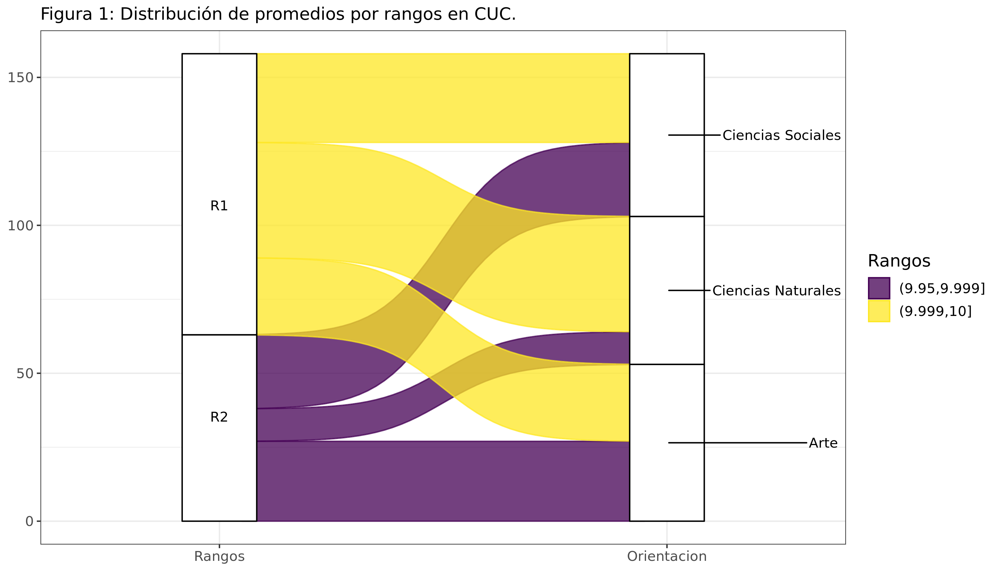
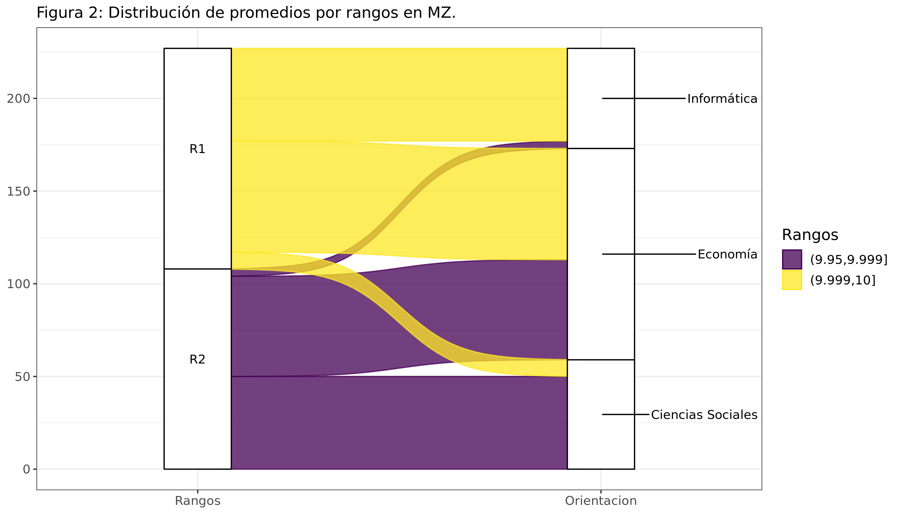
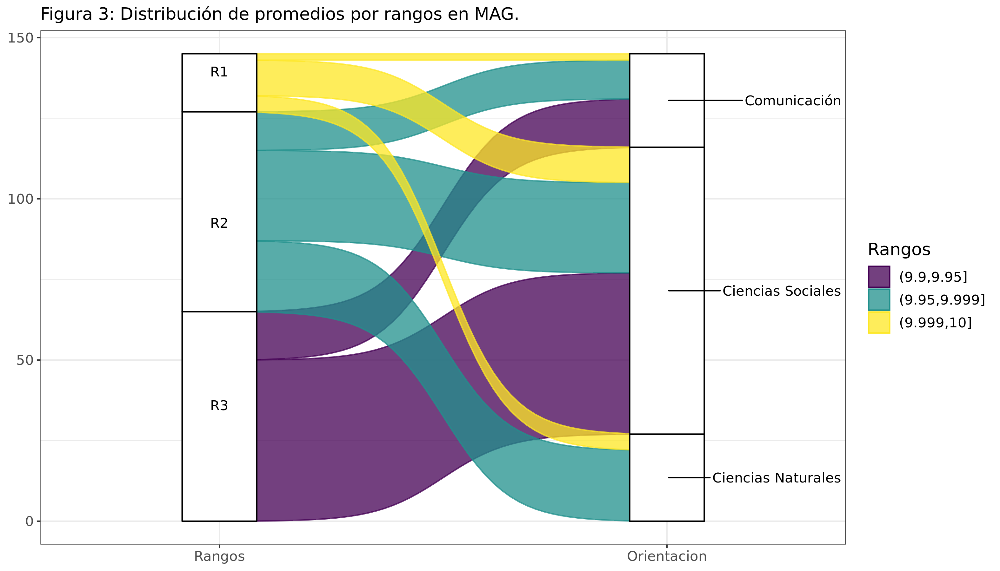
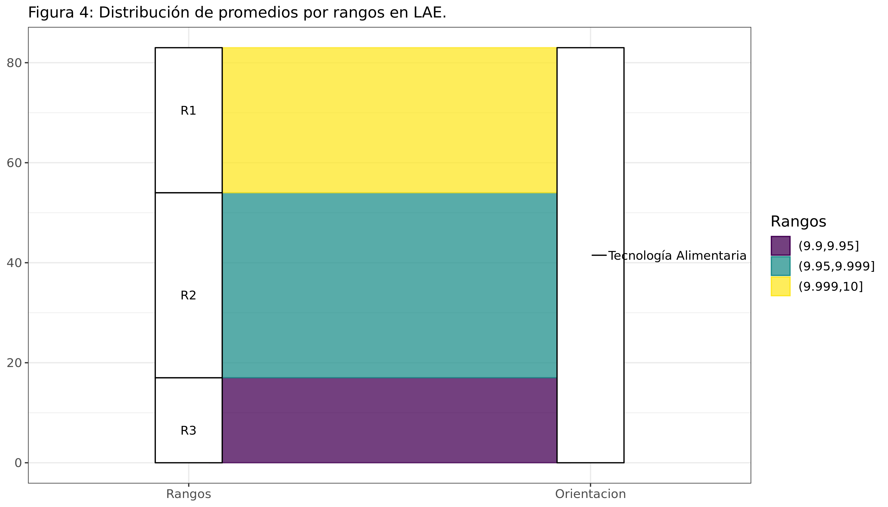
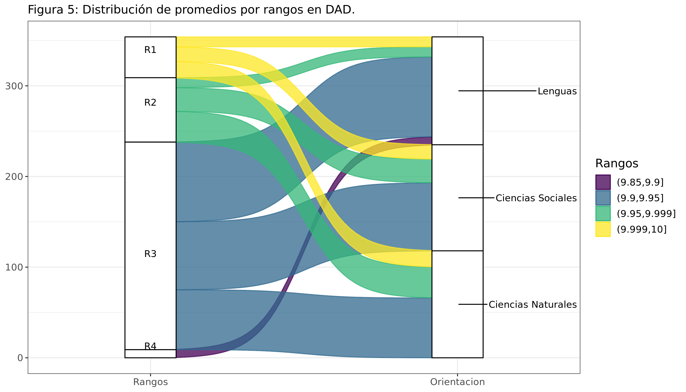

<style type="text/css">

body{
font-size: 14pt;
}

/* Headers */s
h1{
font-size: 24pt;
}
h2{
font-size: 22pt;
}
h3{
font-size: 20pt;
}
h4{
font-size: 18pt;
}

</style>

Todos los años alrededor de noviembre, miles de estudiantes del nivel de educación primaria en la provincia de Mendoza postulan a una vacante para ingresar a algunas de las 5 escuelas secundarias que posee la [Universidad Nacional de Cuyo](https://www.uncuyo.edu.ar/secundarios) (UNCuyo) en el Gran Mendoza. Estos colegios son Colegio Universitario Central "José de San Martín" (CUC), Departamento de Aplicación Docente (DAD), Liceo Agrícola y Enológico "Domingo F. Sarmiento" (LAE), Escuela del Magisterio (MAG) y Escuela de Comercio "Martín Zapata" (MZ). A su vez, cada colegio ofrece diferentes orientaciones como en Economía, Ciencias Sociales, Ciencias Naturales, Informática, entre otras. Los 5 colegios ofrecen 8 orientaciones en total. Cabe mencionar que el LAE hace su selección de ingreso antes y por separado del resto de los 4 colegios restantes. De todas formas, se ha decidido incluirlo en este análisis.

Los ingresantes a las escuelas de nivel secundario de la UNCuyo se dividen en dos grupos bien definidos.

Por un lado están los ingresantes por orden de mérito que compiten con un promedio que se forma al tomar las notas de cuarto a sexto grado de Lengua, Matemáticas, Ciencias Sociales, Ciencias Naturales, Educación Física y Educación Artística. Para el ingreso de este año, 2022, solo se tomaron las notas de cuarto y quinto grados, ya que sexto grado se desarrolló durante el año 2020, en plena pandemia, y se decidió no considerar las notas de ese año por ser un año atípico. Además, los postulantes deben determinar el orden de preferencia de las 13 ofertas de escuela y orientación, de mayor a menor (ver tabla 3). Así, mientras mayor sea su promedio, más probable será obtener un banco en el colegio y orientación deseados, según el orden asignado.

Por otro lado, los egresados de la escuela de nivel primario Carmen Vera Arena (CVA), la cual es la única escuela de nivel primario administrada por la UNCuyo, pueden ingresar a los colegios de nivel secundario de la UNCuyo sin postular con un promedio de notas. Por el solo hecho de ser egresados del CVA, tienen asegurado un banco en alguno de los colegios de nivel secundario de la UNCuyo. Se les asignan 5 plazas como máximo de un total de 30 por división. En otras palabras, el 16% de las vacantes son ofrecidas en primer término a los alumnos de séptimo grado de la CVA. Las vacantes restantes serán tomadas por los ingresantes por orden de mérito.

El objetivo de este informe es el de analizar cómo se distribuyen los promedios de los ingresantes por orden de mérito, para de esta manera ver las notas máximas y notas de corte por orientación, qué colegios y orientaciones son los más competitivos y cuáles menos. Adicionalmente, se revelan las preferencias de ingreso de los egresados de la escuela Carmen Vera Arena.

Todo el código de programación utilizado en este informe puede ser bajado del siguiente [link](https://github.com/rodralez/uncuyo-ingreso).

## Extracción de datos

Los resultados de la convocatoria fueron publicados por la UNCuyo en este [documento](https://www.uncuyo.edu.ar/academica/upload/informe-1-ingresantes-2022-orientadas-por-numinsc1.pdf) para los colegios CUC, DAD, MAG y MZ, y en este [documento](https://lae.uncuyo.edu.ar/upload/1-listado-orden-de-merito-lae-2022.pdf) para el LAE, ambos en formato pdf. Dichos documentos contienen una tabla con el número de inscripción, el promedio del ingresante y el colegio y orientación a la que ha accedido. Fue necesario extraer estos datos y transformarlos a un formato más apropiado para facilitar su análisis.

<!-- Previamente los documentos se separan en páginas individuales para facilitar la extracción de los datos. Esto se logra al ejecutar en consola de Linux el comando, -->

<!-- ``` -->
<!-- $ pdftk in.pdf burst -->
<!-- ``` -->

<!-- Los datos se pasan a texto plano. Se obtienen datos tabulados con una clara regularidad. Se utilizan las bibliotecas ``pdftools`` y ``readr`` para pasar los datos de pdf a texto plano y de texto plano al formato ``dataframe``.  -->

<!-- Las funciones ``uncu_2_df`` y ``lae_2_df`` se proveen al final de este informe, en la sección Anexo. -->

<!-- Bibliotecas -->

```{r message=FALSE, warning=FALSE, echo=FALSE}
library(pdftools)
library(readr)
library(dplyr)
library(tidyr)
library(stringr)
library(tibble)
library(kableExtra)
library(DT)
library(tidyr)

```


```{r message=FALSE, warning=FALSE, echo=FALSE}

# Datos del CUC, DAD, MAG, MZ

n_pag <- 18 # Numeros de paginas en el pdf

df <- vector(mode = "list", length = n_pag)

for (idx in 1:n_pag)
{
  pdf_file <- sprintf("./pg_00%02d.pdf", idx)
  
  text <- pdf_text(pdf_file)
  
  data <- uncu_2_df(text)
  
  df[[idx]] <- data
}

# Hacer un solo df
for (idx in 1:n_pag)
{
  if(idx == 1)
  {
    data_uncu <- df[[idx]]
  } 
  else
  {
    data_uncu <-rbind(data_uncu, df[[idx]])
  }
}

# Datos del LAE

n_pag <- 2  # Numeros de paginas en el pdf

df <- vector(mode = "list", length = n_pag)

for (idx in 1:n_pag)
{
  pdf_file <- sprintf("./lae-%d.pdf", idx)
  
  text <- pdf_text(pdf_file)
  
  data <- lae_2_df(text)
  
  df[[idx]] <- data
}

# Hacer un solo df
for (idx in 1:n_pag)
{
  if(idx == 1)
  {
    data_lae <- df[[idx]]
  } 
  else
  {
    data_lae <-rbind(data_lae, df[[idx]])
  }
}

```

## Análisis de los datos

<!-- Como los datos de LAE se toman por separado, se unen los dataframes de todos los colegios para unificar el análisis. Solo interesan la escuela, orientación y promedio de cada ingresante. -->

```{r message=FALSE, warning=FALSE, echo=FALSE}

# Se seleccionan algunas columnas
data_uncu_sm <- data_uncu %>% select(Escuela, Orientacion, Promedio)

# Se unen los dos datasets
data_sm <- rbind(data_uncu_sm, data_lae)
```

### Total de ingresantes por orden de mérito

La UNCuyo ofreció un total de 1.020 vacantes para los colegios secundarios del Gran Mendoza.

```{r message=FALSE, warning=FALSE, echo=FALSE, results='hide'}

# Total de vacantes en CUC, DAD, LAE, MAG, MZ
vacantes_c <- c( 60*3, 120*3, 90, 30+90+30, 120+60+60)

sum(vacantes_c)
```

De un total de 1.020 vacantes, se otorgaron 971 plazas a los ingresantes por orden de mérito. Las restantes 49 vacantes fueron previamente ocupadas por los alumnos del Carmen Vera Arena (CVA).

```{r message=FALSE, warning=FALSE, echo=FALSE, results='hide'}

# Total de ingresantes
ingresantes <- nrow (data_sm)

ingresantes

cva <- vacantes_c - ingresantes
```

### Ingresantes por escuela

En la tabla 1 se muestra cómo se distribuyen por colegio los ingresantes por orden de mérito y los ingresantes del CVA. Además se muestra el porcentaje de ingresos del CVA, según el total de ingresantes de esta escuela (49). La tabla se ordena por la cantidad de ingresos del CVA, de mayor a menor.

```{r message=FALSE, warning=FALSE, echo=FALSE, results='hide'}

data_c <- data_sm %>% group_by(Escuela) %>%
  summarise( Ingresantes = n() ) %>%
  add_column(Vacantes = vacantes_c, .after = "Escuela") %>%
  mutate(CVA = Vacantes - Ingresantes) %>%
  mutate(`CVA_%` = CVA / 49 * 100) #%>%
#mutate(`CVA_%`= cell_spec('CVA_%', "html", color = ifelse(`CVA_%` > 20, "red", "blue")))

options(digits = 3)

data_c %>%
  arrange(desc(CVA)) %>%
  print.data.frame() %>%
  kbl(caption = "Tabla 1: Distribución de los ingresantes por escuela.") %>%
  kable_classic(full_width = F, html_font = "Cambria", ) %>%
  kable_styling(bootstrap_options = c("striped", "hover", "condensed", "responsive"))

# data_c  %>%
#   arrange(desc(CVA)) %>%
#   print.data.frame() %>%
#   datatable(class = "display")

# %>%
# column_spec(5, color = ifelse(data_c$`CVA_%` > 20, "red", "blue"))    
# column_spec(5, bold = ifelse(data_c$`CVA_%`> 20, T, F) )
```

Se observa que el 40% de los egresados de CVA ha elegido ingresar al CUC. Le siguen MZ con un 22% y DAD con un 20%. Esto es un adelanto de las preferencias de los ingresantes por órden de mérito que se observarán en las siguientes secciones.

### Ingresantes por orientación

En la tabla 2 se unifican las 8 orientaciones que ofrecen los 5 colegios y se expone cómo se distribuyen por orientación los ingresantes por orden de mérito y los ingresantes del CVA. Además se muestra el porcentaje de ingresantes del CVA, según el total de ingresantes de esta escuela (49). La tabla se ordena por la cantidad de ingresos del CVA, de mayor a menor.

```{r message=FALSE, warning=FALSE, echo=FALSE, results='hide'}
# Total de vacantes por orientacion
vacantes_or <- c( 60, # Artes
                  30+60+120, # Ciencias Naturales
                  60+90+60+120, # Ciencias Sociales
                  30, # Comunicación
                  120, # Economía
                  60, # Informática
                  120, # Lenguas
                  90 # Tecnología Alimentaria
)
data_or <- data_sm %>% group_by(Orientacion) %>%
  summarise( Ingresantes = n() ) %>%
  add_column(Vacantes = vacantes_or, .after = "Orientacion") %>%
  mutate(CVA = Vacantes - Ingresantes) %>%
  mutate('CVA_%' = CVA / 49 * 100)

options(digits = 3)

data_or %>%  arrange(desc(CVA)) %>%  print.data.frame() %>%
  kbl(caption = "Tabla 2: Distribución de los ingresantes por orientación.") %>%
  kable_classic(full_width = F, html_font = "Cambria") %>%
  kable_styling(bootstrap_options = c("striped", "hover", "condensed", "responsive"))
```

### Ingresantes por escuela y orientación

En la tabla 3 se muestran cómo se distribuyen por escuela y por orientación los ingresantes por orden de mérito y los ingresantes del CVA. Además, se muestra el porcentaje de ingresos del CVA y el porcentaje de vacantes efectivas, esto es, las vacantes que no fueron tomadas por los alumnos del CVA. La tabla se ordena por el porcentaje de vacantes efectivas, de menor a mayor.

```{r message=FALSE, warning=FALSE, echo=FALSE, results='hide'}

# Vacantes en CUC, DAD, LAE, MAG, MZ
vacantes_o <- c( 60, 60, 60,
                 120, 120, 120,
                 90,
                 30, 90, 30,
                 60, 120, 60)

data_o <- data_sm %>% group_by(Escuela, Orientacion) %>%
  summarise(Ingresantes = n() ) %>%
  add_column(Vacantes = vacantes_o, .after = "Orientacion") %>%
  mutate(CVA = Vacantes - Ingresantes) %>%
  mutate('CVA_%' = CVA / 49 * 100) %>%
  mutate('Vacantes_ef_%' = (Vacantes - CVA) / Vacantes * 100)

data_o %>%
  arrange_at('Vacantes_ef_%') %>%
  print.data.frame() %>%
  kbl(caption = "Tabla 3: Distribución de los ingresantes por escuela y orientación.") %>%
  kable_classic(full_width = F, html_font = "Cambria") %>%
  kable_styling(bootstrap_options = c("striped", "hover", "condensed", "responsive"))
# %>%
#   column_spec(7,  color = "white",
#     background = spec_color(1:13, end = 0.75))
# column_spec(7, color = "white",
# background = spec_color(data_o$`Vacantes_ef_%`[1:12], end = 0.9),
# popover = paste("am:", data_o$`Vacantes_ef_%`[1:12]))
```

Se observa que los alumnos del CVA prefieren un 20% Artes del CUC, un 18% Informática del MZ y un 14% Ciencias Naturales del CUC. Adicionalmente, en el caso de Arte, se ve que se han tomado el máximo de vacantes disponibles para este grupo de ingresantes, 5 vacantes por división, es decir, 10 vacantes en total.

Debido a que estas 3 orientaciones solo tienen 60 vacantes cada una, esto produce que se ofrezcan relativamente menos plazas para los ingresantes por orden de mérito en dichas orientaciones. Esto se observa en los porcentajes de vacantes efectivas con 83%, 85% y 88%, respectivamente para las 3 orientaciones arriba mencionadas. Al final de la tabla se observa que solo 1 alumno del CVA ha elegido ingresar a Ciencias Sociales del DAD. El resto de las Ciencias Sociales de MAG y MZ no han recibido alumnos del CVA, por lo que las vacantes efectivas de estas dos últimas orientaciones son del 100%.

### Análisis estadístico por escuela y orientación

En esta sección se expone el análisis estadístico de los promedios de los ingresantes por orden de mérito (sin CVA), lo que deriva en obtener los mejores promedios y promedios de corte por escuela y orientación. La siguiente tabla muestra por escuela y orientación: el promedio más alto (Maximo), el promedio de corte o mínimo promedio (Corte) y la  [mediana](https://es.wikipedia.org/wiki/Mediana_(estad%C3%ADstica)) de los promedios (Mediana), todos ordenados por el promedio de corte, de mayor a menor.

```{r message=FALSE, warning=FALSE, echo=FALSE, results='hide'}

data_sta <- data_sm %>% group_by(Escuela, Orientacion) %>%
  summarise(Maximo = max(Promedio),
            Corte = min(Promedio),
            Mediana = median(Promedio),
  )

options(digits = 4)

data_sta %>% arrange(desc(Corte)) %>% print.data.frame() %>%
  kbl(caption = "Tabla 4: Análisis estadístico por escuela y orientación.") %>%
  kable_classic(full_width = F, html_font = "Cambria") %>%
  kable_styling(bootstrap_options = c("striped", "hover", "condensed", "responsive"))
```

Se advierte que las mayores notas de cortes están en Ciencias Naturales del CUC, Informática del MZ y Artes y Ciencias Sociales, ambas del CUC. Esto quiere decir que los ingresantes con mejores promedios han postulado a algunas de estas 4 combinaciones. En el otro extremo, Lenguas del DAD presenta la nota de corte más baja. Cabe destacar que la mediana de Ciencias Naturales del CUC es de 10, lo que indica que al menos la mitad de los ingresantes en esta orientación tiene un promedio igual a 10.

### ¿A qué escuelas y orientaciones van los 10?

Se analiza a continuación a qué escuela y orientación postulan aquellos ingresantes que tienen un promedio igual a 10, es decir, los ingresantes con los promedios más altos. Los datos se ordenan por el porcentaje de dieces, de mayor a menor.

```{r message=FALSE, warning=FALSE, echo=FALSE, results='hide'}

data_d <- data_sm %>% group_by(Escuela, Orientacion) %>%
  filter (Promedio == 10.000) %>%
  summarise(Dieces = n()) %>%
  add_column(Ingresantes = data_o$Ingresantes, .after = "Orientacion") %>%
  mutate(`Dieces_%` = Dieces/Ingresantes*100)

data_d_s <- data_d %>% summarise(Dieces = sum(Dieces)) %>%
  add_column(Ingresantes = data_c$Ingresantes, .after = "Escuela") %>%
  mutate(`Dieces_%` = Dieces/Ingresantes*100)

options(digits = 3)

arrange(data_d_s, desc(`Dieces_%`)) %>% print.data.frame() %>%
  kbl(caption = "Tabla 5: Distribución por escuela de los promedios iguales a 10.") %>%
  kable_classic(full_width = F, html_font = "Cambria") %>%
  kable_styling(bootstrap_options = c("striped", "hover", "condensed", "responsive"))

arrange(data_d, desc(`Dieces_%`)) %>% print.data.frame() %>%
  kbl(caption = "Tabla 6: Distribución por escuela y orientación de los promedios iguales a 10.") %>%
  kable_classic(full_width = F, html_font = "Cambria") %>%
  kable_styling(bootstrap_options = c("striped", "hover", "condensed", "responsive"))
```

La tabla 5 muestra el total de promedios igual a 10 que recibe cada escuela. Se observa que el CUC es la escuela que más dieces recibe con 76, un 47% del total de vacantes. Le sigue el MZ con 57, con casi 25% del total del total de vacantes. Más lejos se encuentran LAE, MAG Y DAD con 16%, 9% y 6%, respectivamente. Cabe destacar que de un total de 971 ingresantes por orden de mérito, 183 poseen un promedio igual a 10, esto es, casi un 19% del total de ingresantes poseen los promedios más altos posibles.

En la tabla 6 claramente se ve que el CUC es el colegio que más demanda tiene por los ingresantes con promedio 10, con 54%, 46% y 42% de dieces para Ciencias Naturales, Arte y Ciencias Sociales, respectivamente, según las vacantes ofrecidas por cada orientación. Le sigue Informática del MZ con 39%. Se confirma que, con un 54%, al menos la mitad de los ingresantes a Ciencias Naturales del CUC tienen promedio igual a 10. Al final de la tabla aparece Lenguas del DAD, lo cual es esperable ya que es la orientación que tiene menor nota de corte (ver tabla 4).

## ¿Cómo se distribuyen los promedios de los ingresantes por orden de mérito?

En las siguientes figuras se dividen los promedios de los ingresantes por orden de mérito en 5 rangos, llamados R1, R2, R3, etc. La tabla 7 muestra los rangos de promedios (Rangos), las etiquetas correspondientes (Etiqueta) y la cantidad de ingresantes por rango (Ingresantes).

Se muestra cómo se distribuyen estos promedios por colegio y por orientación en un gráfico aluvional. El eje _y_ de las figuras representa la cantidad de ingresantes por orden de mérito. Las alturas de las cajas para los rangos R1, R2, R3, etc., representan la proporción de ingresantes que se encuentran en cada una de estas categorías.

```{r message=FALSE, warning=FALSE, echo=FALSE, results='hide'}

library(ggalluvial)
library("viridis") 
library(ggforce)
library(forcats)
library(ggrepel)

# Se crea un nuevo dataframe para graficar los rangos de notas
data_alu <- data_sm %>% ungroup() %>%
  mutate(Ingresantes = row_number(), .before = "Escuela") %>%
  group_by(Rangos = cut(Promedio, breaks = c(9.70, 9.85, 9.90, 9.95, 9.999, 10.00) ) ) %>%
  group_by(Etiqueta = cut(Promedio, breaks = c(9.70, 9.85, 9.90, 9.95, 9.999, 10.00) ) ) %>%
  mutate(. , Etiqueta = fct_recode(Etiqueta , "R1" = "(9.999,10]" )) %>%
  mutate(. , Etiqueta = fct_recode(Etiqueta , "R2" = "(9.95,9.999]" )) %>%
  mutate(. , Etiqueta = fct_recode(Etiqueta , "R3" = "(9.9,9.95]" )) %>%
  mutate(. , Etiqueta = fct_recode(Etiqueta , "R4" = "(9.85,9.9]" )) %>%
  mutate(. , Etiqueta = fct_recode(Etiqueta , "R5" = "(9.7,9.85]" )) %>%
  group_by(Orientacion, Escuela, Promedio)

data_alu %>% ungroup() %>%
  select(Rangos, Etiqueta) %>% 
  group_by(Etiqueta,Rangos) %>%
  summarize( Ingresantes = n() ) %>%
  arrange(desc(Etiqueta)) %>%
  print.data.frame() %>%
  kbl(caption = "Tabla 7: Rangos de promedios.") %>%
  kable_classic(full_width = F, html_font = "Cambria") %>%
  kable_styling(bootstrap_options = c("striped", "hover", "condensed", "responsive"))

# Grafico Aluvional 1
g1 <- data_alu %>% filter(Escuela == "CUC") %>% plot_alu_e(., text_cap="Figura 1: Distribución de promedios por rangos en CUC.")

g2 <- data_alu %>% filter(Escuela == "MZ") %>% plot_alu_e(., text_cap="Figura 2: Distribución de promedios por rangos en MZ.")

g3 <- data_alu %>% filter(Escuela == "MAG") %>% 
  plot_alu_e(., text_cap="Figura 3: Distribución de promedios por rangos en MAG.")

g4 <- data_alu %>% filter(Escuela == "LAE") %>% 
  plot_alu_e(., text_cap="Figura 4: Distribución de promedios por rangos en LAE.")

g5 <- data_alu %>% filter(Escuela == "DAD") %>% 
  plot_alu_e(., text_cap="Figura 5: Distribución de promedios por rangos en DAD.")

# g6 <- data_alu %>% plot_alu_e(., text_cap="Figura 6: Distribución de promedios por rangos y orientaciones.")

# Save files

aspect_ratio <- 1.75
he <- 6
we <- 6
ggsave("./uncu_alu_1.png", g1, height = he , width = we * aspect_ratio)
ggsave("./uncu_alu_2.png", g2, height = he , width = we * aspect_ratio)
ggsave("./uncu_alu_3.png", g3, height = he , width = we * aspect_ratio)
ggsave("./uncu_alu_4.png", g4, height = he , width = we * aspect_ratio)
ggsave("./uncu_alu_5.png", g5, height = he , width = we * aspect_ratio)
# ggsave("./uncu_alu_6.png", g6, height = he , width = we * aspect_ratio)


```


La figura 1 expone que el CUC solo recibe promedios de los rangos R1, R2 y R3. Se verifica que Ciencias Naturales solo admite los mejores promedios, los que están en los rangos R1 y R2.



La figura 2 muestra que el MZ recibe promedios de los rangos R1, R2, R3 y una pequeña parte de R4. Informática está compuesta mayoritariamente por promedios de los rangos R1 y R2. Economía capta promedios de los rangos R1, R2 y R3. Finalmente, Ciencias Sociales recibe promedios de R1, R2, R3 y la pequeña parte de R4.


Según la figura 3, como en el caso del CUC, Ciencias Naturales del MAG también recibe los mejores promedios. Le siguen las orientaciones de Comunicación y Ciencias Sociales.



En la figura 4 se ve que la única orientación que ofrece el LAE recibe promedios de los 5 rangos.



La figura 5 expone que alrededor de la mitad de los ingresantes al DAD están en el rango R5. Y es Lenguas la que recibe la mayor parte de este rango.

<!--  -->

## Conclusiones

En este reporte se analizan los datos provistos por la UNCuyo para el ingreso de alumnos de nivel primario a las escuelas de nivel secundario dependientes de la UNCuyo en el año 2022. Luego de todo lo expuesto en este análisis, se llegan a las siguientes conclusiones.

Una primera conclusión que se puede sacar es que CUC es el rey. Es el colegio con mayor demanda por parte de los alumnos del CVA. Asimismo, es la escuela que alberga más ingresantes por orden de mérito con promedio igual a 10 y posee las notas de corte más altas para sus 3 orientaciones. En consecuencia, es más difícil ingresar al CUC que al resto de los 4 colegios secundarios. Si se ordenan los colegios por notas de corte de mayor a menor, el colegio MZ le sigue de cerca al CUC; luego vienen MAG, LAE y finalmente el DAD.

Por el lado de las orientaciones, se observa una gran demanda en Artes e Informática. Ambas orientaciones ofrecen 60 plazas cada una, pero los alumnos del CVA tomaron 10 y 9 plazas respectivamente, siendo estas orientaciones las más demandadas por los egresados del CVA, luego de Ciencias Naturales con 15 plazas y pero con 210 vacantes (ver tabla 2). En consecuencia, las vacantes efectivas fueron de 50 para Arte y de 51 para Informática. Esta alta demanda también se observa en los ingresantes por orden de mérito ya que Informática solo recibe ingresantes de los grupos R1, R2 y una pequeña porción de R3 (ver figura 2), y Artes solo recibe de los grupos R1, R2 y R3 (ver figura 1). El resto de las orientaciones reciben ingresantes de los 5 grupos de promedios. Si bien Ciencias Naturales del CUC es la escuela y orientación con mayor nota de corte y mayor cantidad de ingresantes con promedio igual a 10, esta orientación también se encuentra en las escuelas MAG y DAD, lo que produce que globalmente sea una orientación relativamente accesible para su ingreso.

En el otro extremo se encuentra Lenguas. Esta orientación ofrece 120 vacantes y solo 4 alumnos del CVA la han elegido. Esta orientación recibe su gran mayoría de ingresantes por orden de mérito del grupo R5, lo que produce que sea la orientación con la menor nota de corte.

A la luz de estos resultados, es evidente que la demanda por ingresar a Artes e Informática es alta, tanto de los ingresantes por orden de mérito como por los egresados del CVA. Una solución para mitigar esta situación es la crear nuevas divisiones para estas 2 orientaciones, tal vez en diferentes colegios si no están dadas las condiciones edilicias en MZ o CUC. De esta manera se podría satisfacer de mejor manera la actual demanda que tienen estas 2 orientaciones. Por otro lado, se podría reevaluar si Lenguas realmente necesita ofrecer 120 vacantes.

En tercer lugar, cabe dedicar algunas palabras a los ingresantes por orden de mérito con promedio igual a 10. De un total de 971 ingresantes por orden de mérito, 183 tienen el más alto promedio. Esto representa un 19% de los ingresantes por orden de mérito. Esto se traduce en que el 19% de los ingresantes solo obtuvieron notas iguales a 10 en cuarto y quinto grados. Si bien esta cifra parece bastante alta, sería conveniente conocer el total de postulantes, los que ingresaron y los que no, para llegar a una respuesta concluyente. Por otra parte, como este año solo se tomaron las notas de cuarto y quinto grados, esto pudo producir un aumento notable de ingresantes por orden de mérito con promedio igual a 10. Por ello, sería conveniente verificar si este alto porcentaje también se observa en años anteriores.

Finalmente, queremos compartir que durante la elaboración de este informe técnico, al tratar este tema con diferentes personas, siempre surgió la pregunta de que si el sistema de ingreso basado en postular con un promedio de notas del nivel primario es un sistema justo, o al menos más justo que el sistema anterior, el cual estaba basado en tomar un examen de ingreso. Queremos destacar esto porque, al parecer, es una pregunta que se hace mucha gente. El sistema actual de ingreso se basa en la hipótesis de que todas las escuelas del nivel inicial de la provincia de Mendoza tienen el mismo nivel de exigencia. En principio, esta parece una hipótesis muy fuerte. Está claro que esta hipótesis no puede ser ni aceptada ni rechazada con los datos que se usaron durante este trabajo. Para ello, a nuestro entender, deberíamos tener datos del desempeño de los ingresantes durante su primer año de secundaria. De esta forma se podría saber si alumnos que ingresaron con un promedio alto luego tuvieron un desempeño satisfactorio según los estándares de las escuelas de nivel secundario de la UNCuyo, o no. Y en consecuencia, poder saber si el sistema de ingreso por promedio de notas garantiza que ingresen los mejores alumnos.


## Agradecimiento

Los autores agradecen los comentarios y correcciones de la Prof. María Elena Armendariz, Psicopedagoga y Profesora en Ciencias Psicopedagógicas, los cuales han ayudado a enriquecer este reporte.


<!-- ## Anexo: funciones auxiliares -->

<!-- Función ``uncu_2_df``. -->


```{r message=FALSE, warning=FALSE, echo=FALSE}

uncu_2_df <- function(text)
{
  write.csv( text, file="./text.txt",
             col.names = FALSE,
             row.names = FALSE )
  data <- readr::read_fwf(
    file = "./text.txt",
    col_positions = fwf_widths( c(21, 50, 36, 22, 15) ,
                                col_names = c("Preinscripcion",
                                              "Escuela",
                                              "Orientacion",
                                              "Promedio",
                                              "Aleatorio")
    ),
    col_types = c("i", "c", "c", "d", "i") ,
    skip = 5,
  )
  data <- data %>% filter (!is.na(Preinscripcion))
  
  data <- data %>%
    mutate_at("Promedio", str_replace, "," , ".") %>%
    mutate_at("Escuela", str_replace,
              "Colegio Universitario Central José de San Martin" , "CUC") %>%
    mutate_at("Escuela", str_replace,
              "Departamento de Aplicación Docente" , "DAD") %>%
    mutate_at("Escuela", str_replace,
              "Escuela de Comercio Martín Zapata" , "MZ") %>%
    mutate_at("Escuela", str_replace,
              "Escuela del Magisterio" , "MAG") %>%
    mutate_at("Orientacion", str_replace,
              "Ciencias Sociales y Humanidades" , "Ciencias Sociales") %>%
    mutate_at("Orientacion", str_replace,
              "Arte Multimedia" , "Arte") %>%
    mutate_at("Orientacion", str_replace,
              "Economía y Administración" , "Economía") %>%
    arrange( match(Escuela, c("CUC", "MZ", "MAG", "DAD") ) )
  
  options(digits = 6)
  data <- data %>% mutate ( Promedio = as.double(Promedio))
  
  system("rm ./text.txt")
  return(data)
}

```

<!-- Función ``lae_2_df``. -->

```{r message=FALSE, warning=FALSE, echo=FALSE}

lae_2_df <- function(text)
{
  write.csv( text, file="./text.txt",
             col.names = FALSE,
             row.names = FALSE )
  data <- readr::read_fwf(
    file = "./text.txt",
    col_positions = fwf_widths( c(28, 20, 8) ,
                                col_names = c("Orden",
                                              "Preinscripcion",
                                              "Promedio")
    ),
    col_types = c("i", "i", "d") ,
    skip = 3,
  )
  data <- data %>% filter (!is.na(Preinscripcion))
  
  data <- data %>%
    mutate_at("Promedio", str_replace, "," , ".") %>%
    add_column(Escuela = "LAE", .before = "Promedio") %>%
    add_column(Orientacion = "Tecnología Alimentaria", .before = "Promedio") %>%
    select(Escuela, Orientacion, Promedio)
  
  options(digits = 6)
  data <- data %>% mutate ( Promedio = as.double(Promedio))
  
  system("rm ./text.txt")
  
  return(data)
}
```

<!-- Función ``plot_alu_e``. -->

```{r message=FALSE, warning=FALSE, echo=FALSE}

plot_alu_e <- function(data, text_cap)
{
  data %>%
    
    ggplot( aes(
      axis1 = Etiqueta,
      axis2 = Orientacion, ),
    ) + #
    # geom_alluvium( aes(fill = Rangos, color = Rangos ),
    # width = 1/12 ,
    # alpha = 0.35 ,
    # reverse = FALSE,
    # ) +
    geom_flow(aes(fill = Rangos, color = Rangos ),
              curve_type = "sigmoid",
              width = 1/10,
              alpha = 0.75,
              reverse = FALSE,) + 
    geom_stratum(width = 1/6 , fill = "white",
                 color = "black",
                 reverse = FALSE,
                 # position = 1,
    ) +
    # geom_label(stat = "stratum",
    #            aes(label = after_stat(stratum)),
    #            reverse = FALSE,
    #            size = 3,
    #            color = "black",
    #            ) +
    scale_x_discrete(limits = c("Rangos", "Orientacion"),
                     expand = c(0.2 , 0.2) ) +
    scale_color_viridis(discrete = TRUE, option = "D") +
    scale_fill_viridis( discrete = TRUE, option = "D") +
    #=========================================================
  ggrepel::geom_text_repel(
    aes(label = ifelse(after_stat(x) == 1, as.character(after_stat(stratum)), NA)),
    stat = "stratum", size = 3.65, direction = "y", nudge_x = 0, reverse = FALSE,
  ) + ggrepel::geom_text_repel(
    aes(label = ifelse(after_stat(x) == 2, as.character(after_stat(stratum)), NA)),
    stat = "stratum", size = 3.65, direction = "y", nudge_x = +.35, reverse = FALSE,
  ) +
    #=========================================================
  theme_bw() +
    theme(text = element_text(size = 13, family = 'Arial')) +
    theme(plot.title = element_text(size = 13, family = 'Arial')) +
    ggtitle(text_cap)
  
}

#   #=========================================================
#  ggrepel::geom_text_repel(
#   aes(label = ifelse(after_stat(x) == 1, as.character(after_stat(stratum)), NA)),
#   stat = "stratum", size = 3.65, direction = "y", nudge_x = 0, reverse = FALSE,
# ) +  ggrepel::geom_text_repel(
#   aes(label = ifelse(after_stat(x) == 2, as.character(after_stat(stratum)), NA)),
#   stat = "stratum", size = 3.65, direction = "y", nudge_x = +.35, reverse = FALSE,
# ) +
#   #=========================================================

```
</br>
</br>
</br>
