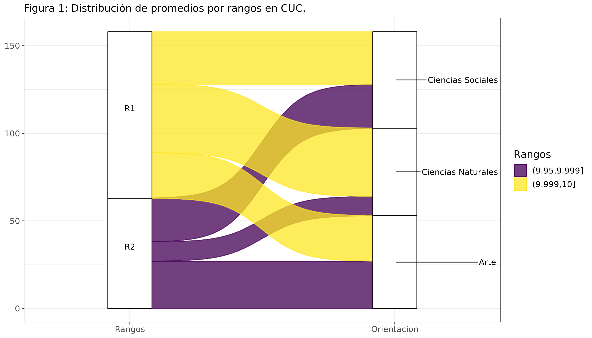
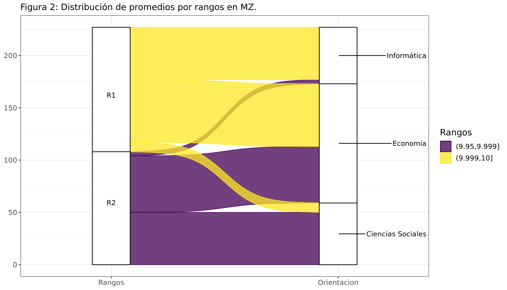
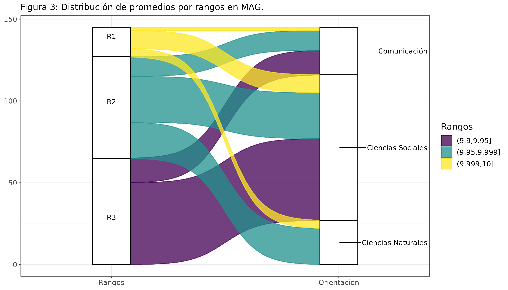
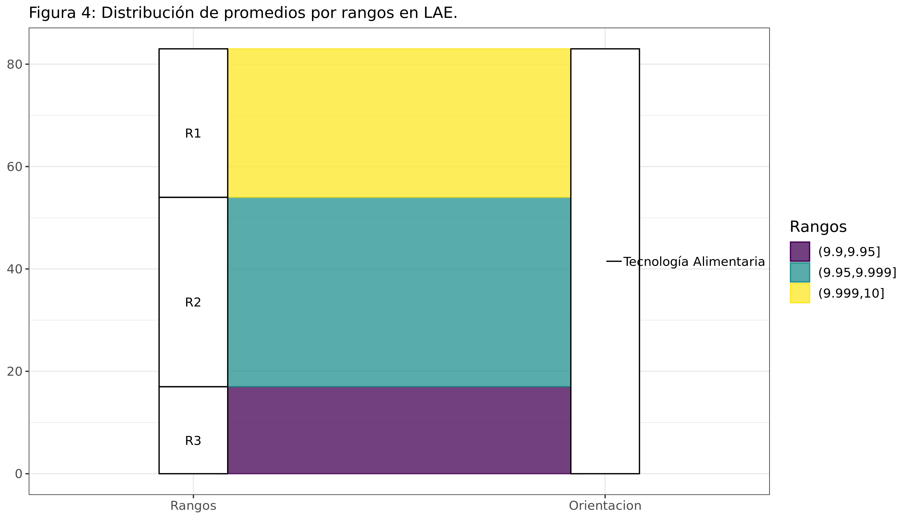
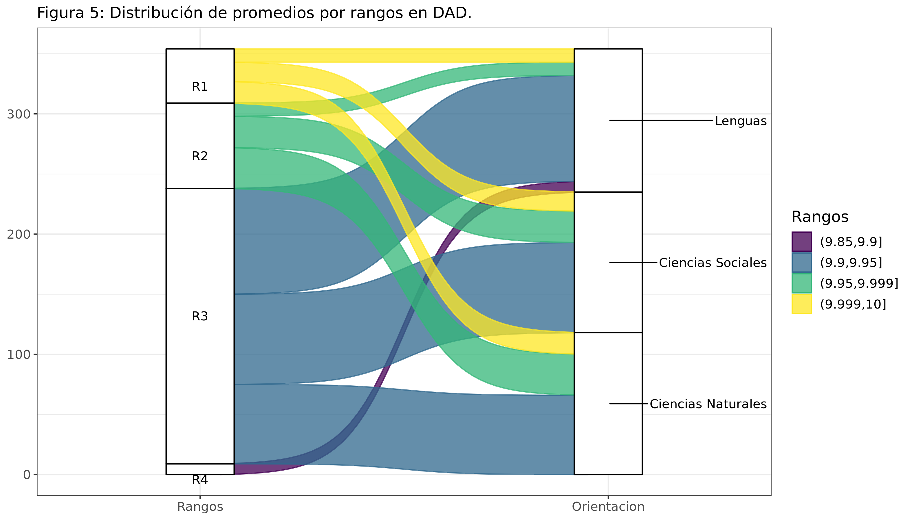

<style type="text/css">

body{
font-size: 14pt;
}

/* Headers */s
h1{
font-size: 24pt;
}
h2{
font-size: 22pt;
}
h3{
font-size: 20pt;
}
h4{
font-size: 18pt;
}

</style>

```{r message=FALSE, warning=FALSE, include=FALSE, results='hide'}
rm(list = ls()) # clean global environment
cat("\014")  # clean the console
setwd("/home/rodralez/hostdir/uncuyo-ingreso/")
```

```{r message=FALSE, warning=FALSE, include=FALSE, results='hide'}
source("/home/rodralez/hostdir/uncuyo-ingreso/code/R/functions/uncu_functions.R")
```

```{r message=FALSE, warning=FALSE, include=FALSE, results='hide'}
library(pdftools)
library(readr)
library(dplyr)
library(tidyr)
library(stringr)
library(tibble)
library(kableExtra)
library(DT)
library(tidyr)
```


Todos los años alrededor de noviembre, miles de estudiantes del nivel de educación primaria en la provincia de Mendoza postulan a una vacante para ingresar a algunas de las 5 escuelas secundarias que posee la [Universidad Nacional de Cuyo](https://www.uncuyo.edu.ar/secundarios) (UNCuyo) en el Gran Mendoza. Estos colegios son Colegio Universitario Central "José de San Martín" (CUC), Departamento de Aplicación Docente (DAD), Liceo Agrícola y Enológico "Domingo F. Sarmiento" (LAE), Escuela del Magisterio (MAG) y Escuela de Comercio "Martín Zapata" (MZ). A su vez, cada colegio ofrece diferentes orientaciones como en Economía, Ciencias Sociales, Ciencias Naturales, Informática, entre otras. Los 5 colegios ofrecen 8 orientaciones en total. Cabe mencionar que el LAE hace su selección de ingreso antes y por separado del resto de los 4 colegios restantes. De todas formas, se ha decidido incluirlo en este análisis.

Los ingresantes a las escuelas de nivel secundario de la UNCuyo se dividen en dos grupos bien definidos.

Por un lado están los ingresantes por orden de mérito que compiten con un promedio que se forma al tomar las notas de cuarto a sexto grado de Lengua, Matemáticas, Ciencias Sociales, Ciencias Naturales, Educación Física y Educación Artística. 

<!-- Para el ingreso de este año, 2023, solo se tomaron las notas de cuarto y quinto grados, ya que sexto grado se desarrolló durante el año 2020, en plena pandemia, y se decidió no considerar las notas de ese año por ser un año atípico. Además,  -->

Los postulantes deben determinar el orden de preferencia de las 13 ofertas de escuela y orientación, de mayor a menor (ver tabla 3). Así, mientras mayor sea su promedio, más probable será obtener un banco en el colegio y orientación deseados, según el orden asignado.

Por otro lado, los egresados de la escuela de nivel primario Carmen Vera Arena (CVA), la cual es la única escuela de nivel primario administrada por la UNCuyo, pueden ingresar a los colegios de nivel secundario de la UNCuyo sin postular con un promedio de notas. Por el solo hecho de ser egresados del CVA tienen asegurado un banco en alguno de los colegios de nivel secundario de la UNCuyo. Se les asignan 5 plazas como máximo de un total de 30 por división. En otras palabras, el 16% de las vacantes son ofrecidas en primer término a los alumnos de séptimo grado de la CVA. Las vacantes restantes serán tomadas por los ingresantes por orden de mérito.

El objetivo de este informe es el de analizar cómo se distribuyen los promedios de los ingresantes por orden de mérito, para de esta manera ver las notas máximas y notas de corte por orientación, qué colegios y orientaciones son los más competitivos y cuáles menos. Adicionalmente, se revelan las preferencias de ingreso de los egresados de la escuela Carmen Vera Arena.

Todo el código de programación utilizado en este informe puede ser bajado del siguiente [link](https://github.com/rodralez/uncuyo-ingreso/code).

## Extracción de datos

Los resultados de la convocatoria son publicados por la UNCuyo en formato pdf para los colegios CUC, DAD, MAG y MZ por un lado, y para el LAE por otro. Dichos documentos contienen una tabla con el número de inscripción, el promedio del ingresante y el colegio y orientación al que ha accedido. Es necesario extraer estos datos y transformarlos a un formato más apropiado para facilitar su análisis.

<!-- Previamente los documentos se separan en páginas individuales para facilitar la extracción de los datos. Esto se logra al ejecutar en consola de Linux el comando, -->

<!-- ``` -->
<!-- $ pdftk in.pdf burst -->
<!-- ``` -->

<!-- Los datos se pasan a texto plano. Se obtienen datos tabulados con una clara regularidad. Se utilizan las bibliotecas ``pdftools`` y ``readr`` para pasar los datos de pdf a texto plano y de texto plano al formato ``dataframe``.  -->

<!-- Las funciones ``uncu_2_df`` y ``lae_2_df`` se proveen al final de este informe, en la sección Anexo. -->

```{r message=FALSE, warning=FALSE, include=FALSE, results='hide'}
# Datos del CUC, DAD, MAG, MZ

n_pag <- 21 # Numeros de paginas en el pdf

df <- vector(mode = "list", length = n_pag)

for (idx in 1:n_pag)
{
  pdf_file <- sprintf("../../../doc/pg_00%02d.pdf", idx)
  
  rawdata <- pdf_text(pdf_file)
    
  data <- uncu_2_df(rawdata)
  
  df[[idx]] <- data
}

# Hacer un solo df
for (idx in 1:n_pag)
{
  if(idx == 1)
  {
    data_uncu <- df[[idx]]
  } 
  else
  {
    data_uncu <-rbind(data_uncu, df[[idx]])
  }
}
```


```{r message=FALSE, warning=FALSE, include=FALSE, results='hide'}
# Datos del LAE

n_pag <- 2  # Numeros de paginas en el pdf

df <- vector(mode = "list", length = n_pag)

for (idx in 1:n_pag)
{
  pdf_file <- sprintf("../../../doc/lae_%02d.pdf", idx)

  rawdata <- pdf_text(pdf_file)

  data <- lae_2_df(text)

  df[[idx]] <- data
}

# Hacer un solo df
for (idx in 1:n_pag)
{
  if(idx == 1)
  {
    data_lae <- df[[idx]]
  }
  else
  {
    data_lae <-rbind(data_lae, df[[idx]])
  }
}

```

## Análisis de los datos

<!-- Como los datos de LAE se toman por separado, se unen los dataframes de todos los colegios para unificar el análisis. Solo interesan la escuela, orientación y promedio de cada ingresante. -->

```{r message=FALSE, warning=FALSE, include=FALSE, results='hide'}

# Se seleccionan algunas columnas
data_uncu_sm <- data_uncu %>% select(Escuela, Orientacion, Promedio)

# Se unen los dos datasets
data_sm <- rbind(data_uncu_sm, data_lae)
```

### Total de ingresantes por orden de mérito

```{r message=FALSE, warning=FALSE, include=FALSE, results='hide'}

# Total de vacantes en CUC, DAD, LAE, MAG, MZ
vacantes_c <- c( 60*3, 120*3, 90, 30+90+30, 120+60+60)

# total de vacantes
vacantes_t <- sum(vacantes_c)
# vacantes efectivas
vacantes_o <- nrow(data_sm)
# vacantes tomadas por el carmen vera arema
vacantes_cva <- vacantes_t - vacantes_o
```

La UNCuyo ofreció un total de `r vacantes_t` vacantes para los colegios secundarios del Gran Mendoza.

De un total de `r vacantes_t` vacantes, se otorgaron `r vacantes_o` plazas a los ingresantes por orden de mérito. Las restantes `r vacantes_cva` vacantes fueron previamente ocupadas por los alumnos del Carmen Vera Arena (CVA).

### Ingresantes por escuela

En la tabla 1 se muestra cómo se distribuyen por colegio los ingresantes por orden de mérito y los ingresantes del CVA. Además se muestra el porcentaje de ingresos del CVA, según el total de ingresantes de esta escuela (`r vacantes_cva`). La tabla se ordena por la cantidad de ingresos del CVA, de mayor a menor.

```{r message=FALSE, warning=FALSE, echo=FALSE}

data_c <- data_sm %>% group_by(Escuela) %>%
  summarise( Ingresantes = n() ) %>%
  add_column(Vacantes = vacantes_c, .after = "Escuela") %>%
  mutate(CVA = Vacantes - Ingresantes) %>%
  mutate(`CVA_%` = CVA / vacantes_cva * 100) %>%
  arrange(desc(CVA))

cva_1 <-round(data_c$`CVA_%`[1])
cva_2 <-round(data_c$`CVA_%`[2])
cva_3 <-round(data_c$`CVA_%`[3])

options(digits = 3)

data_c %>%
  arrange(desc(CVA)) %>%
  # print.data.frame() %>%
  kbl(caption = "Tabla 1: Distribución de los ingresantes por escuela.") %>%
  kable_classic(full_width = F, html_font = "Cambria", ) %>%
  kable_styling(bootstrap_options = c("striped", "hover", "condensed", "responsive"))

```

Se observa que el `r cva_1`% de los egresados de CVA ha elegido ingresar al `r data_c$Escuela[1]`. Le siguen `r data_c$Escuela[2]` con un `r cva_2`% y `r data_c$Escuela[3]` con un `r cva_3`%.

Esto es un adelanto de las preferencias de los ingresantes por órden de mérito que se observarán en las siguientes secciones.

### Ingresantes por orientación

En la tabla 2 se unifican las 8 orientaciones que ofrecen los 5 colegios y se expone cómo se distribuyen por orientación los ingresantes por orden de mérito y los ingresantes del CVA. Además se muestra el porcentaje de ingresantes del CVA, según el total de ingresantes de esta escuela (`r vacantes_cva`). La tabla se ordena por la cantidad de ingresos del CVA, de mayor a menor.

```{r message=FALSE, warning=FALSE, echo=FALSE}
# Total de vacantes por orientacion
vacantes_or <- c( 60, # Artes
                  30+60+120, # Ciencias Naturales
                  60+90+60+120, # Ciencias Sociales
                  30, # Comunicación
                  120, # Economía
                  60, # Informática
                  120, # Lenguas
                  90 # Tecnología Alimentaria
)
data_or <- data_sm %>% group_by(Orientacion) %>%
  summarise( Ingresantes = n() ) %>%
  add_column(Vacantes = vacantes_or, .after = "Orientacion") %>%
  mutate(CVA = Vacantes - Ingresantes) %>%
  mutate('CVA_%' = CVA / vacantes_cva * 100)

options(digits = 3)

data_or %>% arrange(desc(CVA)) %>%  
  kbl(caption = "Tabla 2: Distribución de los ingresantes por orientación.") %>%
  kable_classic(full_width = F, html_font = "Cambria") %>%
  kable_styling(bootstrap_options = c("striped", "hover", "condensed", "responsive"))
```

### Ingresantes por escuela y orientación

En la tabla 3 se muestran cómo se distribuyen por escuela y por orientación los ingresantes por orden de mérito y los ingresantes del CVA. Además, se muestra el porcentaje de ingresos del CVA y el porcentaje de vacantes efectivas, esto es, las vacantes que no fueron tomadas por los alumnos del CVA. La tabla se ordena por el porcentaje de vacantes efectivas, de menor a mayor.

```{r message=FALSE, warning=FALSE, echo=FALSE}

# Vacantes en CUC, DAD, LAE, MAG, MZ
vacantes_cu <- c( 60, 60, 60,
                 120, 120, 120,
                 90,
                 30, 90, 30,
                 60, 120, 60)

data_o <- data_sm %>% group_by(Escuela, Orientacion) %>%
  summarise(Ingresantes = n() ) %>%
  add_column(Vacantes = vacantes_cu, .after = "Orientacion") %>%
  mutate(CVA = Vacantes - Ingresantes) %>%
  mutate('CVA_%' = CVA / vacantes_cva * 100) %>%
  mutate('Vacantes_ef_%' = (Vacantes - CVA) / Vacantes * 100) %>%
  arrange(desc(CVA))

cva_1 <-round(data_o$`CVA_%`[1])
cva_2 <-round(data_o$`CVA_%`[2])
cva_3 <-round(data_o$`CVA_%`[3])

esc_1 <-(data_o$Escuela[1])
esc_2 <-(data_o$Escuela[2])
esc_3 <-(data_o$Escuela[3])

ori_1 <-(data_o$Orientacion[1])
ori_2 <-(data_o$Orientacion[2])
ori_3 <-(data_o$Orientacion[3])

data_o %>%
  arrange_at('Vacantes_ef_%') %>%
  kbl(caption = "Tabla 3: Distribución de los ingresantes por escuela y orientación.") %>%
  kable_classic(full_width = F, html_font = "Cambria") %>%
  kable_styling(bootstrap_options = c("striped", "hover", "condensed", "responsive"))
# %>%
#   column_spec(7,  color = "white",
#     background = spec_color(1:13, end = 0.75))
# column_spec(7, color = "white",
# background = spec_color(data_o$`Vacantes_ef_%`[1:12], end = 0.9),
# popover = paste("am:", data_o$`Vacantes_ef_%`[1:12]))
```

Se observa que los alumnos del CVA prefieren un `r cva_1`% `r ori_1` del `r esc_1`, un `r cva_2`% `r ori_2` del `r esc_2` y un `r cva_3`% `r ori_3` del `r esc_3`. 

Adicionalmente, en el caso de Ciencias Naturales, se ve que se han tomado el máximo de vacantes disponibles para este grupo de ingresantes, 5 vacantes por división, es decir, 10 vacantes en total. Esto indica una importante demanda por esta orientación y colegio. 

Debido a que las 3 primeras orientaciones en la tabla 3, Ciencias Naturales del CUC, Arte del CUC e Informática del MZ, solo ofrecen 60 vacantes cada una, esto produce que se ofrezcan relativamente menos plazas para los ingresantes por orden de mérito en dichas orientaciones. Esto se observa en los porcentajes de vacantes efectivas con 83%, 88% y un 90%, respectivamente. Al final de la tabla se observa que solo 1 alumno del CVA ha elegido ingresar a Lenguas del DAD. Por último, se observa que todas las orientaciones y escuelas han recibido al menos 1 alumno del CVA.

### Análisis estadístico por escuela y orientación

En esta sección se expone el análisis estadístico de los promedios de los ingresantes por orden de mérito (sin CVA), lo que deriva en obtener los mejores promedios y promedios de corte por escuela y orientación. La siguiente tabla muestra por escuela y orientación: el promedio más alto (Maximo), el promedio de corte o mínimo promedio (Corte) y la [mediana](https://es.wikipedia.org/wiki/Mediana_(estad%C3%ADstica)) de los promedios (Mediana), todos ordenados por el promedio de corte, de mayor a menor.

```{r message=FALSE, warning=FALSE, echo=FALSE}

data_sta <- data_sm %>% group_by(Escuela, Orientacion) %>%
  summarise(Maximo = max(Promedio),
            Mediana = median(Promedio),
            Corte = min(Promedio),
  )

options(digits = 4)

data_sta %>% arrange(desc(Corte)) %>% 
  kbl(caption = "Tabla 4: Análisis estadístico por escuela y orientación.") %>%
  kable_classic(full_width = F, html_font = "Cambria") %>%
  kable_styling(bootstrap_options = c("striped", "hover", "condensed", "responsive"))
```

Se advierte que las mayores notas de cortes están en Ciencias Naturales del CUC, Informática del MZ y Artes y Ciencias Sociales, ambas del CUC, y en Economía del MZ. Esto quiere decir que los ingresantes con mejores promedios han postulado a algunas de estas 5 combinaciones. En el otro extremo, Lenguas del DAD presenta la nota de corte más baja. Cabe destacar que la mediana es de 10 para Ciencias Naturales y Ciencias Sociales del CUC, y para Informática y Economía del MZ. Esto indica que al menos la mitad de los ingresantes en estas 4 orientaciones tiene un promedio igual a 10.

### ¿A qué escuelas y orientaciones van los 10?

Se analiza a continuación a qué escuela y orientación postulan aquellos ingresantes que tienen un promedio igual a 10, es decir, los ingresantes con los promedios más altos, típicamente abanderados en sus escuelas de nivel primario de origen. Los datos se ordenan por el porcentaje de dieces, de mayor a menor.

```{r message=FALSE, warning=FALSE, echo=FALSE}

data_o <- data_o %>% arrange(Escuela, Orientacion)

data_do <- data_sm %>% 
  ungroup() %>% 
  filter (Promedio == 10.00) %>%
  group_by(Escuela, Orientacion) %>%
  summarise(Dieces = n()) %>%
  add_column(Ingresantes = data_o$Ingresantes, .after = "Orientacion") %>%
  mutate(`Dieces_%` = Dieces/Ingresantes*100) %>% 
  arrange(desc(`Dieces_%`))

data_c <- data_c %>% arrange(Escuela)

data_dc <- data_do %>% 
  summarise(Dieces = sum(Dieces)) %>%
  add_column(Ingresantes = data_c$Ingresantes, .after = "Escuela") %>%
  mutate(`Dieces_%` = Dieces/Ingresantes*100) %>% 
  arrange(desc(`Dieces_%`))
  
diez_1 <- round(data_dc$`Dieces_%`[1])
diez_2 <- round(data_dc$`Dieces_%`[2])
diez_3 <- round(data_dc$`Dieces_%`[3])
diez_4 <- round(data_dc$`Dieces_%`[4])
diez_5 <- round(data_dc$`Dieces_%`[5])

diez_o1 <- round(data_do$`Dieces_%`[1])
diez_o2 <- round(data_do$`Dieces_%`[2])
diez_o3 <- round(data_do$`Dieces_%`[3])
diez_o4 <- round(data_do$`Dieces_%`[4])
diez_o5 <- round(data_do$`Dieces_%`[5])

options(digits = 3)

arrange(data_dc, desc(`Dieces_%`)) %>% 
  kbl(caption = "Tabla 5: Distribución por escuela de los promedios iguales a 10.") %>%
  kable_classic(full_width = F, html_font = "Cambria") %>%
  kable_styling(bootstrap_options = c("striped", "hover", "condensed", "responsive"))

arrange(data_do, desc(`Dieces_%`)) %>%
  kbl(caption = "Tabla 6: Distribución por escuela y orientación de los promedios iguales a 10.") %>%
  kable_classic(full_width = F, html_font = "Cambria") %>%
  kable_styling(bootstrap_options = c("striped", "hover", "condensed", "responsive"))
```

La tabla 5 muestra el total de promedios igual a 10 que recibe cada escuela. Se observa que el `r data_dc$Escuela[1]` es la escuela con mayor porcentaje de dieces respecto a sus ingresantes por orden de mérito con un `r diez_1`%. Le sigue el `r data_dc$Escuela[2]` con `r diez_2`%. Más lejos se encuentran `r data_dc$Escuela[3]`, `r data_dc$Escuela[4]` y `r data_dc$Escuela[5]` con `r diez_3`%, `r diez_4`% y `r diez_5`%, respectivamente. Cabe destacar que de un total de `r sum(data_dc$Ingresantes)` ingresantes por orden de mérito, `r sum(data_dc$Dieces)` poseen un promedio igual a 10, esto es, casi un `r round(sum(data_dc$Dieces)/sum(data_dc$Ingresantes)*100)`% del total de ingresantes poseen los promedios más altos posibles.

En la tabla 6 se ven las orientaciones con mayor demanda entre los ingresantes con promedio igual a 10. En los primeros lugares se ubican `r data_do$Orientacion[1]` del `r data_do$Escuela[1]`,  `r data_do$Orientacion[2]` del `r data_do$Escuela[2]`, `r data_do$Orientacion[3]` del `r data_do$Escuela[3]` y `r data_do$Orientacion[4]` del `r data_do$Escuela[4]`, con `r diez_o1`%, `r diez_o2`%, `r diez_o3`% y `r diez_o4`%, respectivamente.

<!-- se ve que el CUC y MZ son los colegios que más demanda tienen entre los ingresantes con promedio 10, con 54%, 46% y 42% de dieces para Ciencias Naturales, Arte y Ciencias Sociales, respectivamente, según las vacantes ofrecidas por cada orientación. Le sigue Informática del MZ con 39%.  -->

<!-- Se confirma que, con un 54%, al menos la mitad de los ingresantes a Ciencias Naturales del CUC tienen promedio igual a 10. Al final de la tabla aparece Lenguas del DAD, lo cual es esperable ya que es la orientación que tiene menor nota de corte (ver tabla 4). -->

## ¿Cómo se distribuyen los promedios de los ingresantes por orden de mérito?

En las siguientes figuras se dividen los promedios de los ingresantes por orden de mérito en 5 rangos, llamados R1, R2, R3, etc. La tabla 7 muestra los rangos de promedios (Rangos), las etiquetas correspondientes (Etiqueta) y la cantidad de ingresantes por rango (Ingresantes).

Se muestra cómo se distribuyen estos promedios por colegio y por orientación en un gráfico aluvional. El eje _y_ de las figuras representa la cantidad de ingresantes por orden de mérito. Las alturas de las cajas para los rangos R1, R2, R3, etc., representan la proporción de ingresantes que se encuentran en cada una de estas categorías.

```{r message=FALSE, warning=FALSE, echo=FALSE}

library(ggalluvial)
library("viridis") 
library(ggforce)
library(forcats)
library(ggrepel)

# Se crea un nuevo dataframe para graficar los rangos de notas
data_alu <- data_sm %>% ungroup() %>%
  mutate(Ingresantes = row_number(), .before = "Escuela") %>%
  group_by(Rangos = cut(Promedio, breaks = c(9.70, 9.85, 9.90, 9.95, 9.999, 10.00) ) ) %>%
  group_by(Etiqueta = cut(Promedio, breaks = c(9.70, 9.85, 9.90, 9.95, 9.999, 10.00) ) ) %>%
  mutate(. , Etiqueta = fct_recode(Etiqueta , "R1" = "(9.999,10]" )) %>%
  mutate(. , Etiqueta = fct_recode(Etiqueta , "R2" = "(9.95,9.999]" )) %>%
  mutate(. , Etiqueta = fct_recode(Etiqueta , "R3" = "(9.9,9.95]" )) %>%
  mutate(. , Etiqueta = fct_recode(Etiqueta , "R4" = "(9.85,9.9]" )) %>%
  mutate(. , Etiqueta = fct_recode(Etiqueta , "R5" = "(9.7,9.85]" )) %>%
  group_by(Orientacion, Escuela, Promedio)

data_alu %>% ungroup() %>%
  select(Rangos, Etiqueta) %>% 
  group_by(Etiqueta,Rangos) %>%
  summarize( Ingresantes = n() ) %>%
  arrange(desc(Etiqueta)) %>%
  kbl(caption = "Tabla 7: Rangos de promedios.") %>%
  kable_classic(full_width = F, html_font = "Cambria") %>%
  kable_styling(bootstrap_options = c("striped", "hover", "condensed", "responsive"))

# Grafico Aluvional 1
g1 <- data_alu %>% filter(Escuela == "CUC") %>% plot_alu_e(., text_cap="Figura 1: Distribución de promedios por rangos en CUC.")

g2 <- data_alu %>% filter(Escuela == "MZ") %>% plot_alu_e(., text_cap="Figura 2: Distribución de promedios por rangos en MZ.")

g3 <- data_alu %>% filter(Escuela == "MAG") %>% 
  plot_alu_e(., text_cap="Figura 3: Distribución de promedios por rangos en MAG.")

g4 <- data_alu %>% filter(Escuela == "LAE") %>% 
  plot_alu_e(., text_cap="Figura 4: Distribución de promedios por rangos en LAE.")

g5 <- data_alu %>% filter(Escuela == "DAD") %>% 
  plot_alu_e(., text_cap="Figura 5: Distribución de promedios por rangos en DAD.")

# g6 <- data_alu %>% plot_alu_e(., text_cap="Figura 6: Distribución de promedios por rangos y orientaciones.")

# Save files

aspect_ratio <- 1.75
he <- 6
we <- 6
ggsave("../../../images/uncu_alu_1.png", g1, height = he , width = we * aspect_ratio)
ggsave("../../../images/uncu_alu_2.png", g2, height = he , width = we * aspect_ratio)
ggsave("../../../images/uncu_alu_3.png", g3, height = he , width = we * aspect_ratio)
ggsave("../../../images/uncu_alu_4.png", g4, height = he , width = we * aspect_ratio)
ggsave("../../../images/uncu_alu_5.png", g5, height = he , width = we * aspect_ratio)
# ggsave("./uncu_alu_6.png", g6, height = he , width = we * aspect_ratio)


```


La figura 1 expone que el CUC solo recibe promedios de los rangos R1 y R2. Se verifica que Ciencias Naturales solo admite los mejores promedios, mayoritariamente los que están en el rango R1.



La figura 2 muestra que el MZ solo recibe promedios de los rangos R1 y R2. Informática está compuesta mayoritariamente por promedios del rango R1. Economía capta promedios de los rangos R1 y R2. Finalmente, Ciencias Sociales recibe mayoritariamente promedios de R2.


Se observa en la figura 3, como en el caso del CUC, Ciencias Naturales del MAG también recibe los mejores promedios en los rangos R1 y R2. Las restantes orientaciones, Comunicación y Ciencias Sociales, reciben promedios de los rangos R1, R2 y R3 en prácticamente las mismas proporciones.



En la figura 4 se ve que la única orientación que ofrece el LAE recibe promedios de los 3 primeros rangos, mayoritariamente de R2.



La figura 5 expone que más de la mitad de los ingresantes del DAD están en el rango R3. Es la única escuela que recibe ingresantes del rango R4, y en una única orientación, Lenguas.


## Conclusiones

En este reporte se analizan los datos provistos por la UNCuyo para el ingreso de alumnos de nivel primario a las escuelas de nivel secundario dependientes de la UNCuyo en el año 2023. Luego de todo lo expuesto en este análisis, se llegan a las siguientes conclusiones.

Una primera conclusión que se puede sacar es que CUC es la escuela a la que quieren ingresar todos. Es el colegio con mayor demanda por parte de los alumnos del CVA (ver tabla 1). Asimismo, es la escuela que alberga el porcentaje más alto de ingresantes por orden de mérito con promedio igual a 10 (ver tabla 5) y posee las notas de corte más altas para sus 3 orientaciones (ver tabla 4). En consecuencia, es más difícil ingresar al CUC que al resto de los 4 colegios. En segundo lugar se ubica el MZ, con 2 de sus 3 orientaciones con mayores notas de corte y también segundo en porcentaje de ingresantes por orden de mérito con promedio igual a 10, aunque primero en cantidad (ver tabla 5). Si se ordenan los colegios por notas de corte de mayor a menor, el colegio MZ le sigue de cerca al CUC; luego vienen MAG, LAE y finalmente el DAD.

Al analizar las orientaciones en colegios determinados, se observa una gran demanda en Ciencias Naturales del CUC, en Informática del MZ y en Arte del CUC, en ese orden. Las 3 orientaciones ofrecen 60 plazas cada una, pero los alumnos del CVA tomaron 10, 7 y 6 plazas, respectivamente, siendo estas 3 orientaciones las más demandadas por los egresados del CVA. Por tanto, son las orientaciones con las menores tasas de vacantes efectivas (ver tabla 3). Esta alta demanda también se observa en los ingresantes por orden de mérito ya que las 3 orientaciones solo reciben ingresantes de los grupos R1 y R2 (ver figuras 1 y 2). Además, Ciencias Naturales del CUC e Informática del MZ tienen las notas de corte más altas, ambas con 9.985; seguidos por Arte y Ciencias Sociales del CUC y Economía del MZ (ver tabla 4), las 3 con 9.971. Por último, Ciencias Naturales del CUC e Informática del MZ tienen los mayores porcentajes de ingresantes con promedio 10, con un 78% para el primero y un muy llamativo 93% para el segundo (ver tabla 6). Le siguen Ciencias Sociales del CUC, Economía del MZ y Arte del CUC con 55%, 53% y 49%, respectivamente. 

En el otro extremo se encuentra Lenguas del DAD. Esta orientación ofrece 120 vacantes y solo 1 alumno del CVA la ha elegido. Esta orientación recibe su gran mayoría de ingresantes por orden de mérito del grupo R4, lo que produce que sea la orientación con la menor nota de corte.

A la luz de estos resultados, es evidente que la demanda por ingresar a Ciencias Naturales, Ciencias Sociales y Arte del CUC e Informática y Ecomonía del MZ es alta, tanto de los ingresantes por orden de mérito como por los egresados del CVA. Si bien Ciencias Naturales y Ciencias Sociales del CUC son muy demandadas, estas orientaciones ofrecen 210 y 330 plazas respectivamente (ver tabla 2) al considerar todos los colegios de la UNCuyo, ya que también se encuentra en el MAG y el DAD. Por tanto, la demanda por Informática y Arte es efectivamente la más importante, ya que solo se ofrecen 60 plazas cada una teniendo en cuenta todos los colegios de la UNCuyo.

Una solución para mitigar esta situación es la crear nuevas divisiones para Informática y Arte, tal vez en diferentes colegios si no están dadas las condiciones edilicias en MZ o CUC. De esta manera se podría satisfacer de mejor manera la actual demanda que tienen estas dos orientaciones. Por otro lado, se podría reevaluar si Lenguas realmente necesita ofrecer 120 vacantes.

Finalmente, cabe dedicar algunas palabras a los ingresantes por orden de mérito con promedio igual a 10. 
<!-- Cabe destacar que de un total de  ingresantes por orden de mérito,  poseen un promedio igual a 10, esto es, casi un `r round(sum(data_dc$Dieces)/sum(data_dc$Ingresantes))*100`% del total de ingresantes poseen los promedios más altos posibles.  --> De un total de `r sum(data_dc$Ingresantes)` ingresantes por orden de mérito, `r sum(data_dc$Dieces)` tienen el más alto promedio. Esto se traduce en que el `r round(sum(data_dc$Dieces)/sum(data_dc$Ingresantes)*100)`% de los ingresantes solo obtuvieron notas iguales a 10 entre cuarto y sexto grados. Si bien esta cifra parece bastante alta, sería conveniente conocer el total de postulantes, los que ingresaron y los que no, para llegar a una respuesta concluyente. Adicionalmente, como se señalara más arriba, 50 de los 54 ingresantes por orden de mérito a Informática tienen promedio 10, esto es, han sido abanderados en sus escuelas primarias de origen. Aun sin tener en cuenta a los 6 ingresantes del CVA, los cuales quizás también han aportado 1 abanderado extra. ¿Podemos llamar a Informática la Orientación de los Abanderados? ;-)


</br>
</br>
</br>
